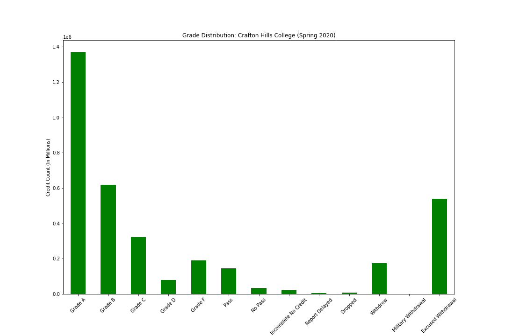
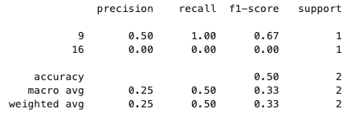
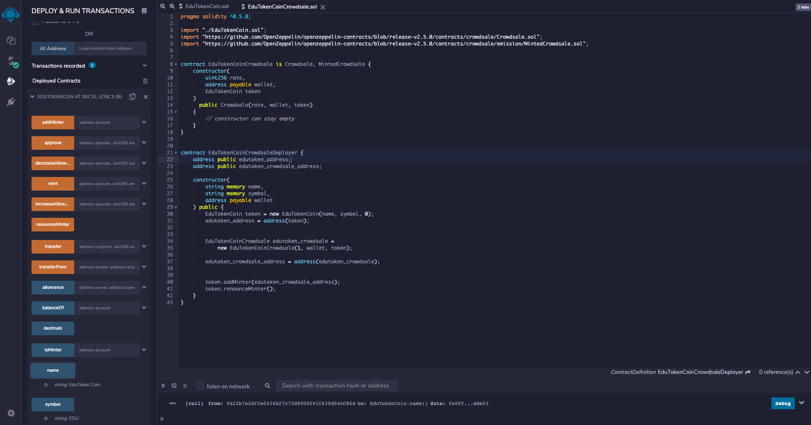
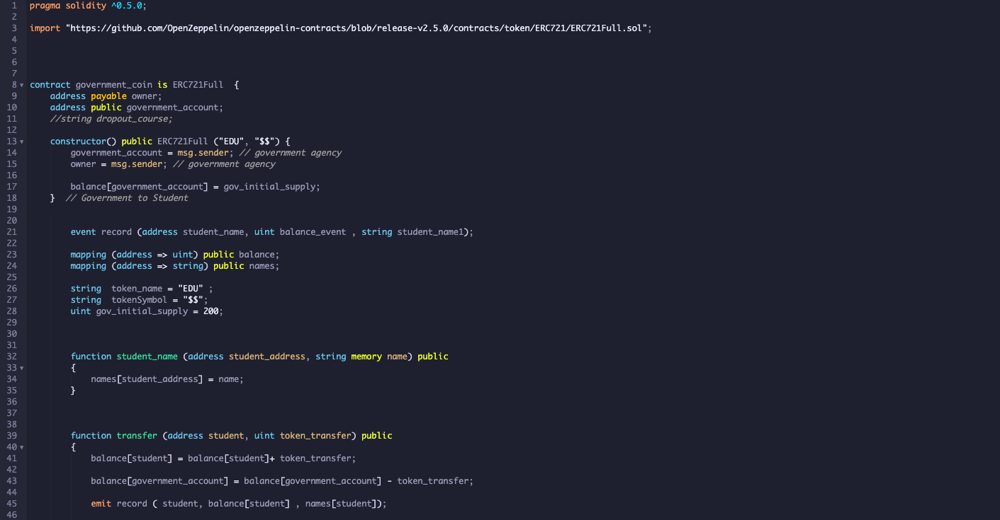
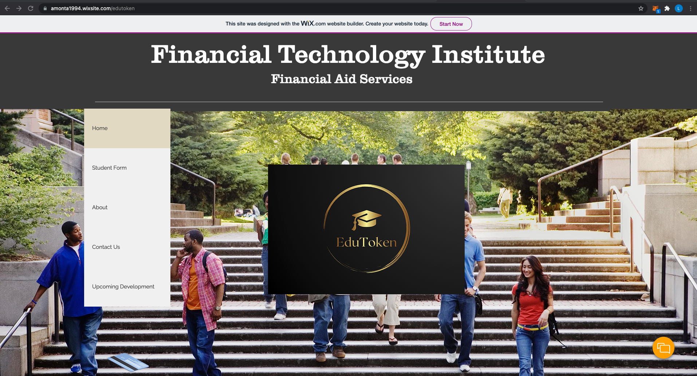
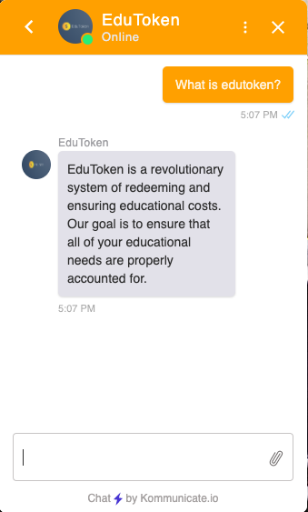

# EduToken

EduToken represents a new financial aid distribution system, and the deployment of a non-fungible token designed to cut adminstrative costs, promote accountability, and increase accessibility for all students. The token is designed to represent an educational credit for a CA community college. The system is designed as follows:
1) NFTs (EduTokens) are deployed by a state or federal agency to all qualifying students. Students may only use the tokens in exchange for educational credits, they are not transferable to other students nor exchangeable for another type of currency. The adminstrative costs associated with financial aid are greatly diminished by direct access to the students, and the inability for students to exchange the tokens for anything other than educational credits helps ensure accountability and prevent unnecessary loss. This is governed by a smart contract. 
2) The students are able to use their tokens to apply for their desired classes. While still in development, the vision is to create an API for students to access classes available, and then to create an additional smart contract that allows the transfer of tokens from the student to the desired educational facility. 
3) Following drop deadlines for the college, the college can then exchange the tokens to the state for the appropriate amount of funds. EduTokens can only be exchanged for currency when it is a college that is "cashing out" all tokens to the appropriate governmental body, and would likely be guided by a third smart contract.
 
 ## Technologies
 * Sklearn: Logistic regression model, train_test_split function, confusion matrix, classification report
 * Remix: For smart contract design using Solidity
 * MetaMask: Cryptocurrency wallet
 * Ganache: For ethereum address and local blockchain deployment
 * Wix: For website development
 * Kommunicate: Chatbot integration
 * Amazon Lex: Chatbot development
 * Heroku: For hosting decentralized application
 * Pandas: For dataframe creation, cleaning, and running machine learning models
 * Pathlib: Import CSV file
 
 ## Examples
 Crafton Hills College Grade Distribution (Spring 2020)
 
 
 Classification report for simple screening
 
 
 ICO Deployment
 
 
 Smart Contract Design Sample
 
 
 Website Interface Sample
 
 
 Streamlit Interface
 
 
 Embedded Chatbot
 
 
 ## Further Development
 Our team was able to construct an initial screening process using machine learning, a sample initial coin offering for funding, a smart contract governing the minting and deploying of tokens to students, a corresponding Streamlit application, a webiste interface, and working chatbot, this still only represents the beginning of such a substantial project. At present, the machine learning models used for screening are highly underdeveloped and do not contain the amount of data necessary for a full screening model. Substantive research into student success factors are necessary to create a working model goes beyond GPA as an indicator for success. At present, it was decided it was best to create a model--despite being underdeveloped at present--that can be added to as we are able to continue to research student indicators for success. Likewise, the ICO depolyment is designed at present to represent a prototype for a more sophisticated offering. Again, it was decided that it would be best, given time constraints, to produce a working ICO deployment model that could be refined if given more time. The smart contract can be successfully deployed, but our team would like to add more functionality (particularly in the form of events) for future installments. Additionally, the smart contract design for student to school, and school to government is still in need of development. Our team also desires to use an application other than Streamlit in the future to create our dApp, as we found the integration of the Streamlit application to our website was not feasible with our current design. Lastly, we would like to further develop the Chatbot to sync with voice-based AI-powered assistants like Alexa or Siri, and to become more flexible with how it is able to interpret questions. While overall, we are very satisfied with our initial product, this represents only the beginning of a fully working prototype.
 
 ## Contributors 
 Developed By:
 * Aruna Bisht: Head of smart contract design, dApp development
 * Lucas Manning: Project manager. In charge of overall system design, ICO deployment, screening interface, scheduling, deligation of tasks, presentation development.
 * Aaron Montano: Alexa integration, developement and integration of chatbot, website design

## License
UC Berkeley Extension FinTech Program
 
 

